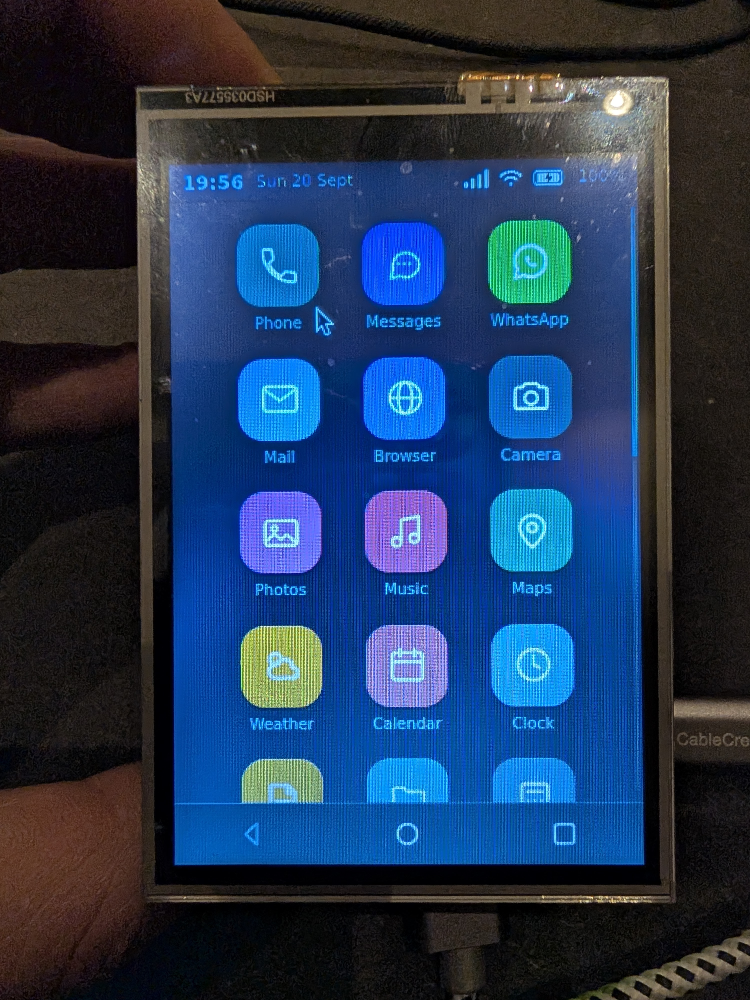
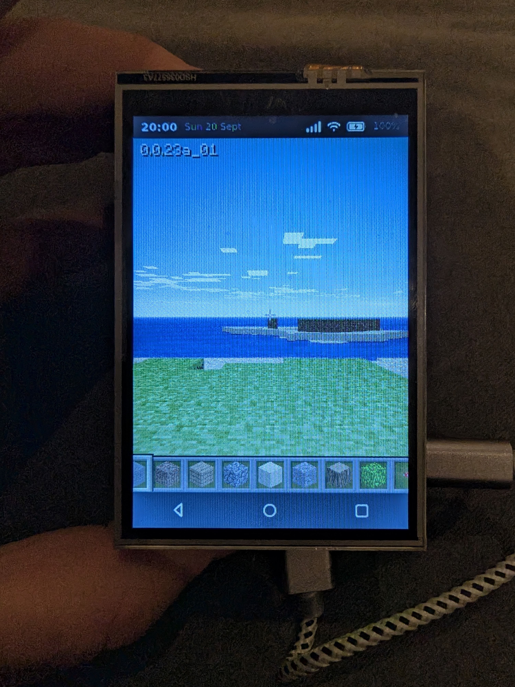

# Infone

*A prototype phone using a Raspberry Pi 5 and a 3.5" resistive touchscreen (52Pi KZ-0060). The phone launcher is a webpage with a local webserver, loaded via Chromium in kiosk mode. With some help from Claude. Project by Zachary Burke, age 8.*

<p align="center">
  
  
</p>

## Prelims

Update the SD card image to Raspberry Pi Trixie via the [Raspberry Pi Imager](https://www.raspberrypi.com/software/).

Set up the Raspberry Pi via HDMI and a USB keyboard/trackpad.

In `sudo raspi-config`, enable the SSH server.

Better editing: `sudo apt install vim`

Sample commands:

```bash
ssh infone@infone.local
scp infone.html infone@infone.local:/home/infone/infone
```

## Enable the display and swap touch XY

In `/boot/firmware/config.txt`:

```ini
dtparam=spi=on
dtoverlay=piscreen,drm,speed=18000000,rotate=90,swapxy
```

## Limit touch to the touchscreen (not HDMI)

```bash
mkdir -p ~/.config/labwc
cp /etc/xdg/labwc/rc.xml ~/.config/labwc/rc.xml
```

Then add:

```xml
<touch deviceName="ADS7846 Touchscreen" mapToOutput="SPI-1" mouseEmulation="no"/>
```

```bash
sudo apt install evtest
sudo evtest
```

## Calibrate the display

Otherwise touches at the edge won't work:

```bash
sudo python calibrate.py
```

Then follow the instructions.

## Webserver / client

```bash
mkdir -p ~/infone ~/.config/systemd/user
```

Copy `infone.html` to `~/infone/`

Copy `infone-helper.service` to `~/.config/systemd/user/`

Copy `infone-server.py` to `~/infone/`

Enable the service:

```bash
systemctl --user daemon-reload
systemctl --user enable --now infone-helper
sudo loginctl enable-linger infone
```

## Autostart Chromium in kiosk mode

```bash
mkdir -p ~/.config/labwc
nano ~/.config/labwc/autostart
```

In the autostart file:

```bash
/usr/bin/lwrespawn chromium --kiosk file:///127.0.0.1/ \
  --noerrdialogs --disable-infobars --no-first-run \
  --disable-session-crashed-bubble --disable-features=Translate \
  --password-store=basic --enable-features=OverlayScrollbar \
  --window-size=320,480 --window-position=0,0 &
```
